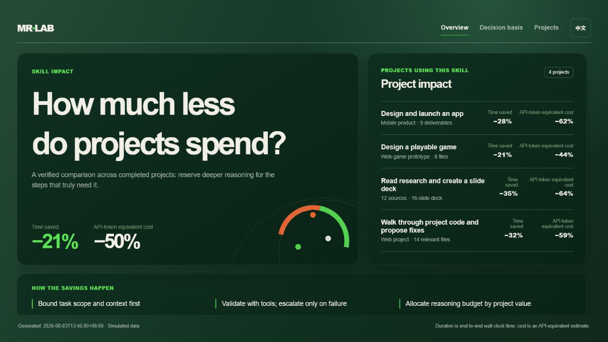

# Model Router Skill

一个面向长任务与软件交付的模型路由 Skill：先缩小问题，再用确定性工具验证，最后只在有证据时使用或升级模型。

## 能解决什么

- 将复杂任务拆成有文件范围、最小上下文、验证命令和风险等级的步骤。
- 将搜索、依赖分析、测试、静态检查、格式化与结构化提取优先路由为 `tool`。
- 将候选生成与验证分开：`fast` / `balanced` 先生成，验证失败或风险升高后才进入 `deep`。
- 维护项目架构、接口契约与决策记录，并按变更摘要和依赖关系提供增量上下文。
- 按可逆性与失败成本配置预算、授权和升级条件。
- 在任务结束后打开本地仪表盘，查看项目维度的耗时、API token 等效成本、模型步骤与验证信息。

## 快速开始

1. 复制 `model-router.config.example.json` 为 `model-router.config.json`，配置已授权模型与价格快照。
2. 更新 `memory/architecture.md`、`memory/contracts.md` 和 `memory/decisions.md` 中与项目相关的简短内容。
3. 对任务运行：

```powershell
node scripts/route-plan.mjs request.json model-router.config.json
```

4. 如需通过本地网关执行，启动：

```powershell
node gateway/server.mjs --config model-router.config.json
```

5. 任务完成后，启动本地仪表盘：

```powershell
node scripts/serve-dashboard.mjs
```

然后打开 `http://127.0.0.1:8765`。可通过 `node scripts/serve-dashboard.mjs 9000` 指定端口；服务运行期间保持终端打开，按 `Ctrl+C` 停止。仪表盘在 `总览` 中展示策略和阶段用时，在 `项目列表` 中展示每个项目的前后对比、步骤、最小上下文与模型层级。

## 如何阅读仪表盘



上图为当前英文版总览（可通过右上角切换中英文）。它使用内建模拟数据说明路由策略的评估方式，**不是**通用性能承诺，也不包含任何真实 prompt、源代码或密钥。

- **总览**：比较路由策略和固定策略的端到端耗时、API token 等效成本、阶段用时、项目效率和节省幅度。
- **选择依据**：展示任务能力、官方能力与价格、时延、上下文／工具可行性、供应商运行质量和项目验收这六类证据；同时列出模型快照与操作边界。
- **项目列表**：左侧按项目索引，右侧显示使用前／后的耗时与成本、执行步骤、所用档位和验证结果。选中项目只滚动右侧详情区。
- **收益如何产生**：先限定任务与最小上下文，优先用确定性工具验证，只有验证失败或风险上升时才升级模型；推理预算再按项目价值分配。

## 推荐工作流

1. 用 `route-plan.mjs` 生成可验收步骤，并先执行 `tool` 步骤。
2. 对需要生成的步骤从 `fast` 或 `balanced` 开始；仅在有失败证据、高风险或高失败成本时升级到 `deep`。
3. 记录匿名时延、可见 token 代理、验证结果和升级原因；不要记录密钥、完整 prompt、源代码或个人数据。
4. 使用仪表盘审查项目结果和模型选择依据；示例数据须保持“模拟数据”标识，接入真实遥测前先完成数据脱敏与审查。

更多字段定义与真实数据接入格式请见 [`dashboard/README.md`](dashboard/README.md)。

## 自动路由的证据门槛

启用 `routingPolicy.modelSelectionEvidence` 后，每个非工具步骤必须具备以下证据，缺失时路由器会返回 `awaiting_approval`：

- 官方能力、上下文和价格快照；
- 与任务匹配的独立评测或运行信号；
- 项目近期测试或遥测；
- 输入、输出、缓存和推理组成的成本估算；
- 时延预期；
- 所需 API 特性检查。

外部资料只用于筛选候选，项目的定向测试和风险等级优先于任何排行榜。

## 项目结构

- `SKILL.md`：完整使用规范、授权边界与模型选择依据。
- `gateway/`：计划与执行网关。
- `scripts/`：路由计划和匿名遥测汇总脚本。
- `memory/`：项目可复用记忆模板。
- `dashboard/`：本地项目收益仪表盘与模拟数据。
- `benchmark/`：基准场景与汇总工具。
- `tests/`：路由器单元测试。

## 数据与隐私

遥测仅应记录匿名模型、可见 token 代理、时延、验证结果与升级原因；不得记录密钥、完整 prompt、源代码或个人数据。仪表盘样例数据均为模拟数据，必须在接入真实遥测前保持这一标识。

## 验证

```powershell
node --test tests/router.test.mjs
node --check dashboard/app.js
```
