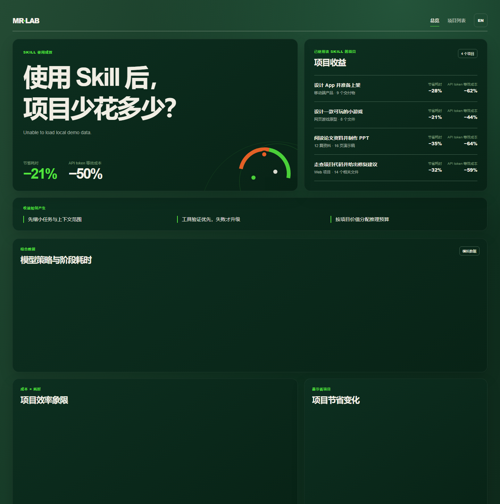

# Model Router Skill

一个面向长任务与软件交付的模型路由 Skill：先缩小问题，再用确定性工具验证，最后只在有证据时使用或升级模型。

## 能解决什么

- 将复杂任务拆成有文件范围、最小上下文、验证命令和风险等级的步骤。
- 将搜索、依赖分析、测试、静态检查、格式化与结构化提取优先路由为 `tool`。
- 将候选生成与验证分开：`fast` / `balanced` 先生成，验证失败或风险升高后才进入 `deep`。
- 维护项目架构、接口契约与决策记录，并按变更摘要和依赖关系提供增量上下文。
- 按可逆性与失败成本配置预算、授权和升级条件。
- 在任务结束后打开本地仪表盘，查看项目维度的耗时、API token 等效成本、模型步骤与验证信息。

## 快速开始

1. 复制 `model-router.config.example.json` 为 `model-router.config.json`，配置已授权模型与价格快照。
2. 更新 `memory/architecture.md`、`memory/contracts.md` 和 `memory/decisions.md` 中与项目相关的简短内容。
3. 对任务运行：

```powershell
node scripts/route-plan.mjs request.json model-router.config.json
```

4. 如需通过本地网关执行，启动：

```powershell
node gateway/server.mjs --config model-router.config.json
```

5. 任务完成后，启动任意静态文件服务器并打开 `dashboard/index.html`。仪表盘在 `总览` 中展示策略和阶段用时，在 `项目列表` 中展示每个项目的前后对比、步骤、最小上下文与模型层级。

## 如何阅读仪表盘



上图是内建模拟数据的中文总览。它用来说明路由策略的评估方式，**不是**通用性能承诺，也不包含任何真实 prompt、源代码或密钥。

- **顶部指标**：比较路由策略与单一模型策略后的端到端时间和 API token 等效成本；示例显示总体节省 21% 的时间与 50% 的成本。
- **项目收益**：按项目列出节省比例，例如“阅读论文资料并制作 PPT”在示例中节省 35% 时间、64% 成本。这可用来判断哪些工作最适合先做范围缩小和工具验证。
- **收益如何产生**：先限定任务与最小上下文，优先用确定性工具验证，只有验证失败或风险上升时才升级模型；推理预算再依项目价值分配。
- **下方图表**：依序用于比较各策略的阶段用时、定位项目的时间／成本效率、比较各项目节省幅度，以及检查节省最多项目的执行路径。图表需要能访问 ECharts CDN；离线时，摘要指标与项目列表仍可阅读。

更多字段定义与真实数据接入格式请见 [`dashboard/README.md`](dashboard/README.md)。

## 自动路由的证据门槛

启用 `routingPolicy.modelSelectionEvidence` 后，每个非工具步骤必须具备以下证据，缺失时路由器会返回 `awaiting_approval`：

- 官方能力、上下文和价格快照；
- 与任务匹配的独立评测或运行信号；
- 项目近期测试或遥测；
- 输入、输出、缓存和推理组成的成本估算；
- 时延预期；
- 所需 API 特性检查。

外部资料只用于筛选候选，项目的定向测试和风险等级优先于任何排行榜。

## 项目结构

- `SKILL.md`：完整使用规范、授权边界与模型选择依据。
- `gateway/`：计划与执行网关。
- `scripts/`：路由计划和匿名遥测汇总脚本。
- `memory/`：项目可复用记忆模板。
- `dashboard/`：本地项目收益仪表盘与模拟数据。
- `benchmark/`：基准场景与汇总工具。
- `tests/`：路由器单元测试。

## 数据与隐私

遥测仅应记录匿名模型、可见 token 代理、时延、验证结果与升级原因；不得记录密钥、完整 prompt、源代码或个人数据。仪表盘样例数据均为模拟数据，必须在接入真实遥测前保持这一标识。

## 验证

```powershell
node --test tests/router.test.mjs
node --check dashboard/app.js
```
